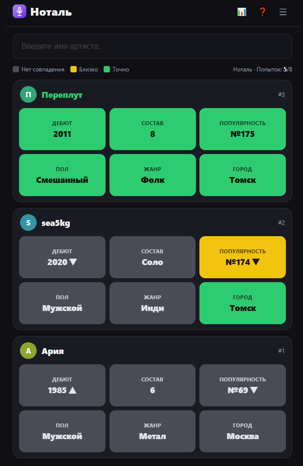

# 🎤 Ноталь

**Русский аналог [Spotle](https://spotle.io/) — ежедневная угадайка про русских музыкантов**

 

---

## 🤖 Полностью сгенерировано нейросетью

Код, база из 176 артистов, оформление и даже этот README созданы с помощью ИИ — от первой строчки до последней. Игра целиком живёт в одном `index.html`: никаких зависимостей, CDN и сборки.

## 🎮 Как играть

- **8 попыток**, чтобы угадать артиста дня (выбирается детерминированно от даты — у всех игроков он одинаковый).
- После каждой попытки открываются **6 плиток**: Дебют, Состав, Популярность, Пол, Жанр, Город.
- 🟩 точно · 🟨 близко · ⬛ мимо. У числовых плиток стрелка ▲/▼ показывает направление к настоящему значению.
- Пороги «близко»: ±5 лет (дебют), ±~10% базы (популярность), тот же регион (город).
- Статистика (сыграно / винрейт / серии / распределение) и «Поделиться» (эмодзи-сетка) хранятся локально в браузере.

Есть режим **«Практика»** (случайный артист) и режим **«Для дальтоников»** — оба в меню игры (☰).

## 📁 Файлы

| файл | что это |
|---|---|
| **`index.html`** | Сама игра, всё в одном файле. Базу подгружает через `fetch('artists.csv')`. |
| **`artists.csv`** | Рабочая база: 176 артистов, 13 жанров. |
| **`icon.svg`** | Иконка приложения (микрофон), favicon и логотип в шапке. |

## 🗃️ Как обновить базу

- **Правкой файла:** отредактируйте `artists.csv` (формат — см. таблицу ниже) и обновите страницу.
- **Через игру:** Меню (☰) → «Загрузить свой CSV» → выберите файл. Он сохранится в браузере (localStorage) и получит приоритет над основной базой. Вернуться назад — Меню → «Перезагрузить базу с сервера».

## 📄 Формат CSV

Первая строка — заголовок, порядок колонок можно менять (сопоставление по названию):

| колонка | что писать |
|---|---|
| `name` | Имя артиста/группы (по нему идёт поиск и проверка ответа) |
| `debut_year` | Год **первого релиза** (альбом/EP/микстейп), целое число |
| `members` | Число участников самого известного состава; `1` = «Соло» |
| `gender` | `Мужской` / `Женский` / `Смешанный` / `Небинарный` |
| `genre` | Ровно один жанр из списка (см. ниже) |
| `city` | Город происхождения (точное совпадение → зелёный) |
| `region` | Регион/округ или страна для «близко» (тот же регион → жёлтый) |
| `popularity` | Любое число, где **больше = популярнее** (напр. число слушателей). Игра сама построит рейтинг «№место» |
| `image` | (необязательно) URL/дата-URI аватара. Пусто → кружок с буквой |
| `track_title` | Один характерный трек для финального экрана |
| `track_link` | Ссылка на прослушивание (Яндекс.Музыка / VK / Zvuk / Apple) |
| `track_cover` | (необязательно) URL обложки трека |

**Жанры (закрытый список):** Поп, Рок, Рэп/Хип-хоп, Шансон, Электроника, Панк, Инди, Метал, Фолк, Авторская песня, Эстрада, R&B, Джаз. Список задаётся в `index.html` (константа `GENRES`) — при желании поправьте под свою сцену.

Поля с запятой внутри берите в двойные кавычки (`"..."`) — стандартный CSV.

## ⚙️ Настройки в коде (начало `<script>` в `index.html`)

- `MAX_GUESSES` — число попыток (по умолчанию 8).
- `DEBUT_CLOSE` — порог «близко» по году (5).
- `GENRES` — список жанров.
- `DB_URL` — адрес базы (по умолчанию относительный `artists.csv`).
